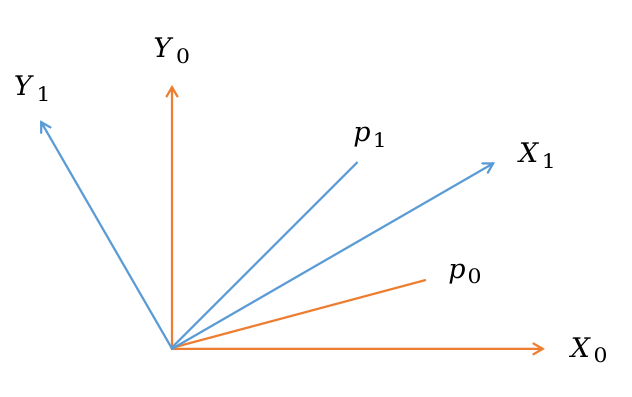
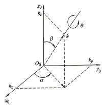
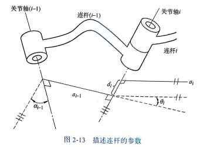
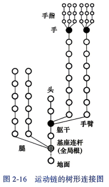
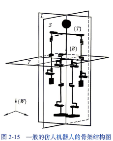

# 1. 数学基础
## 1.1 旋转矩阵
机器人可以看作是一系列连杆通过关节连接组成的刚体。为了表示相邻两个连杆之间的相对位姿关系，引入了旋转矩阵。这个旋转矩阵表示坐标系{1}绕着坐标系{0}的x轴**逆时针**旋转 $\theta$ 度，后面两个分别表示绕y轴和绕z轴
$$ {}_{1}^{0}\boldsymbol{R}_x(\theta) = \begin{bmatrix} 1 & 0 & 0 \\ 0 & \cos\theta & -\sin\theta \\ 0 & \sin\theta & \cos\theta \end{bmatrix} $$
$$ {}_{1}^{0}\boldsymbol{R}_y(\theta) = \begin{bmatrix} \cos\theta & 0 & \sin\theta \\ 0 & 1 & 0 \\ -\sin\theta & 0 & \cos\theta \end{bmatrix} $$
$$ {}_{1}^{0}\boldsymbol{R}_z(\theta) = \begin{bmatrix} \cos\theta & -\sin\theta & 0 \\ \sin\theta & \cos\theta & 0 \\ 0 & 0 & 1 \end{bmatrix} $$
## 1.2 旋转变换
已知给定某点相对于坐标系{1}的坐标为为 ${}^{1}**p**$，且坐标系1相对坐标系{0}的旋转矩阵为 ${}_{1}^{0}\boldsymbol{R}$，那么如果要求同一点相对于坐标系{0}的坐标，如下
$${}^{0}p = {}_{1}^{0}\boldsymbol{R} {}^{1}p$$
这种想法有点绕，可以按照下面的理解
下图中坐标系{1}相对坐标系{0}逆时针旋转 $\theta$ 度，此时 ${}^{1}p$ 就是图中的 $p_1$，它在坐标系{1}中的坐标，其实就等于是 $p_0$在坐标系{0}中的坐标，我们要求的 ${}^{0}p$ 其实就是 $p_1$ 在坐标系{0}下的坐标，其实就等于是 $p_0$ 逆时针旋转 $\theta$ ，换句话说上面的公式可以理解为在同一坐标系下，原向量执行旋转操作后得到的新向量

  

## 1.3 矩阵旋转变换
如果A是一个给定线性变换在坐标系{0}中的矩阵表示，B是同一线性变换在坐标系{1}中的矩阵表示，那么A和B的关系如下
$$ \boldsymbol{B} = \left( {}_{1}^{0}\boldsymbol{R} \right)^{-1} \boldsymbol{A} \, {}_{1}^{0}\boldsymbol{R} $$
## 1.4 旋转叠加变换（当前坐标系）
当前轴的意思是比如先绕X0轴旋转得到坐标系{1}，此为${}_{1}^{0}\boldsymbol{R}_x$，再绕Y1轴旋转，得到坐标系{2}，此为${}_{2}^{1}\boldsymbol{R}$
假定某点在坐标系0，1，2内的坐标为${}^{0}p$ ，${}^{1}p$ ，${}^{2}p$ ，可以得到
$${}^{0}p = {}_{1}^{0}\boldsymbol{R}_x {}_{2}^{1}\boldsymbol{R} {}^{2}p$$
$${}_{2}^{0}\boldsymbol{R} = {}_{1}^{0}\boldsymbol{R}_x {}_{2}^{1}\boldsymbol{R}$$
可以观察得到下标是有规律的
## 1.5 旋转叠加变换（固定轴）
当前轴的意思是比如先绕X0轴旋转，得到坐标系{1}，此为${}_{1}^{0}\boldsymbol{R}_x$，再绕**Y0**轴旋转，得到坐标系{2}，记为$\boldsymbol{R}$，但是这是相对于坐标系{0}的旋转矩阵。此时相对于坐标系{1}的旋转矩阵为$${}_{2}^{1}\boldsymbol{R} = \left( {}_{1}^{0}\boldsymbol{R}_x \right)^{-1} \boldsymbol{R} {}_{1}^{0}\boldsymbol{R}_x$$，参考1.3节矩阵旋转变换
此时旋转矩阵的关系为$${}_{2}^{0}\boldsymbol{R} = {}_{1}^{0}\boldsymbol{R}_x (\left( {}_{1}^{0}\boldsymbol{R}_x \right)^{-1} \boldsymbol{R} {}_{1}^{0}\boldsymbol{R}_x) = \boldsymbol{R} {}_{1}^{0}\boldsymbol{R}_x$$所以相对于固定轴的旋转变换，只要不断左乘新的旋转矩阵即可，与1.4节中的顺序相反

## 1.6 旋转矩阵的综合用法
假设旋转矩阵$\boldsymbol{R}$是一系列基本旋转变换按以下顺序叠加而成： 1) 绕当前$x$轴旋转$\theta$角度。 2) 绕当前$z$轴旋转$\phi$角度。 3) 绕固定$z$轴旋转$\alpha$角度。 4) 绕当前$y$轴旋转$\beta$角度。 5) 绕固定$x$轴旋转$\delta$角度。 为了确定这些旋转变换的累积效应，以第一个旋转变换$\boldsymbol{R}_{x,\theta}$作为起始，然后视情况左乘或右乘相应矩阵，得到 $$ \boldsymbol{R} = \boldsymbol{R}_{x,\delta} \boldsymbol{R}_{z,\alpha} \boldsymbol{R}_{x,\theta} \boldsymbol{R}_{z,\phi} \boldsymbol{R}_{y,\beta}$$
## 1.7 旋转参数表示
本质上是在讨论 $\boldsymbol{R}$ 内部的元素和旋转的关系
### 欧拉法
当进行多次**绕当前轴的旋转**时，可以得到如下表达式
$$ \begin{aligned} R_{ZYZ} &= R_{z,\phi} R_{y,\theta} R_{z,\psi} \\ &= \begin{bmatrix} \cos\phi & -\sin\phi & 0 \\ \sin\phi & \cos\phi & 0 \\ 0 & 0 & 1 \end{bmatrix} \begin{bmatrix} \cos\theta & 0 & \sin\theta \\ 0 & 1 & 0 \\ -\sin\theta & 0 & \cos\theta \end{bmatrix} \begin{bmatrix} \cos\psi & -\sin\psi & 0 \\ \sin\psi & \cos\psi & 0 \\ 0 & 0 & 1 \end{bmatrix} \\ &= \begin{bmatrix} \cos\phi\cos\theta\cos\psi - \sin\phi\sin\psi & -\cos\phi\cos\theta\sin\psi - \sin\phi\cos\psi & \cos\phi\sin\theta \\ \sin\phi\cos\theta\cos\psi + \cos\phi\sin\psi & -\sin\phi\cos\theta\sin\psi + \cos\phi\cos\psi & \sin\phi\sin\theta \\ -\sin\theta\cos\psi & \sin\theta\sin\psi & \cos\theta \end{bmatrix}  = \begin{bmatrix} r_{11} & r_{12} & r_{13} \\ r_{21} & r_{22} & r_{23} \\ r_{31} & r_{32} & r_{33} \end{bmatrix} \end{aligned}$$
情况一：$r_{13}$ 和 $r_{23}$ 不全为零
假设 $r_{13}$ 和 $r_{23}$ 不全为零。 那么，从式 (2-27) 可以推导出 $\sin\theta \neq 0$，因此 $r_{31}$ 和 $r_{32}$ 不全为零。 若 $r_{31}$ 和 $r_{32}$ 不全为零，则 $r_{33} \neq \pm 1$，且有 $\cos\theta = r_{33}$，$\sin\theta = \pm\sqrt{1-r_{33}^2}$。 由此可得俯仰角 $\theta$ 的解为： $$ \theta = \operatorname{Atan2}(r_{33}, \sqrt{1-r_{33}^2})$$
$$ \phi = \operatorname{Atan2}(r_{13}, r_{23})$$
$$ \psi = \operatorname{Atan2}(-r_{31}, r_{32})$$或者 $$ \theta = \operatorname{Atan2}(r_{33}, -\sqrt{1-r_{33}^2}) $$
$$ \phi = \operatorname{Atan2}(-r_{13}, -r_{23})$$
 $$ \psi = \operatorname{Atan2}(r_{31}, -r_{32})$$其中，$\operatorname{Atan2}$ 是附录 B 中定义的双参数反正切函数。 
第二种情况，如果 $r_{13}=r_{23}=0$，那么 $\boldsymbol{R}$ 是正交矩阵，意味着 $r_{33}=\pm 1$，以及 $r_{31}=r_{32}=0$。 所以，矩阵 $\boldsymbol{R}$ 为 $$ \boldsymbol{R}= \begin{bmatrix} r_{11} & r_{12} & 0 \\ r_{21} & r_{22} & 0 \\ 0 & 0 & \pm 1 \end{bmatrix}$$如果 $r_{33}=1$，那么 $\cos\theta=1$，并且 $\sin\theta=0$，所以 $\theta=0$。 这种情况下，式 (2-27) 变为 $$ \begin{bmatrix} \cos\phi\cos\psi - \sin\phi\sin\psi & -\cos\phi\sin\psi - \sin\phi\cos\psi & 0 \\ \sin\phi\cos\psi + \cos\phi\sin\psi & -\sin\phi\sin\psi + \cos\phi\cos\psi & 0 \\ 0 & 0 & 1 \end{bmatrix} = \begin{bmatrix} \cos(\phi+\psi) & -\sin(\phi+\psi) & 0 \\ \sin(\phi+\psi) & \cos(\phi+\psi) & 0 \\ 0 & 0 & 1 \end{bmatrix} $$因此，$\phi$、$\psi$ 之和为 $$ \phi+\psi = \operatorname{Atan2}(r_{11},r_{21}) - \operatorname{Atan2}(r_{11},-r_{12})$$由于在这种情况下只能确定 $(\phi+\psi)$，因而存在无数组可能的解。 此时**可按惯例指定 $\phi=0$**。
如果 $r_{33}=-1$，那么 $\cos\theta=-1$，$\sin\theta=0$，因此 $\theta=\pi$。 此时，式 (2-27) 变为 $$ \begin{bmatrix} -\cos(\phi-\psi) & -\sin(\phi-\psi) & 0 \\ \sin(\phi-\psi) & \cos(\phi-\psi) & 0 \\ 0 & 0 & -1 \end{bmatrix} = \begin{bmatrix} r_{11} & r_{12} & 0 \\ r_{21} & r_{22} & 0 \\ 0 & 0 & -1 \end{bmatrix} $$所以，解是 $$ \phi-\psi = \operatorname{Atan2}(-r_{11},-r_{12}) $$ 与以前类似，存在无穷多解。
### 姿态角
和欧拉角的区别在于**绕固定轴**，所以旋转矩阵的计算是左乘，参考1.5节
如图 2-11 所示，这些旋转决定了**滚动（Roll）角**、**俯仰（Pitch）角**、**偏航（Yaw）角**，将使用 $\phi$、$\theta$ 和 $\psi$ 来指代这些角度。 指定旋转按照 $x \to y \to z$ 的顺序进行，即首先绕 $x_0$ 轴滚动 $\psi$ 角度，接下来绕 $y_0$ 轴俯仰 $\theta$ 角度，最后绕 $z_0$ 轴偏航 $\phi$ 角度。由于这些旋转相对于固定坐标系依次进行，所以最终得到的变换矩阵为： $$ \begin{aligned} R &= R_{z,\phi} R_{y,\theta} R_{x,\psi} \\ &= \begin{bmatrix} \cos\phi & -\sin\phi & 0 \\ \sin\phi & \cos\phi & 0 \\ 0 & 0 & 1 \end{bmatrix} \begin{bmatrix} \cos\theta & 0 & \sin\theta \\ 0 & 1 & 0 \\ -\sin\theta & 0 & \cos\theta \end{bmatrix} \begin{bmatrix} 1 & 0 & 0 \\ 0 & \cos\psi & -\sin\psi \\ 0 & \sin\psi & \cos\psi \end{bmatrix}\end{aligned} $$
后续的推导与欧拉法类似
### 转轴/角度
这是一种更通用的表达方式，原理是任意一个旋转矩阵都可以用绕空间中某个转轴转过适当角度的旋转矩阵来表示，因此定义一个转轴 $\boldsymbol{k} = \begin{bmatrix} k_x & k_y & k_z \end{bmatrix}^T$ ，和相对于此转轴旋转 $\theta$ 的旋转矩阵 $\boldsymbol{R}_{k,\theta}$ 
已知如果进行一些旋转变换能使世界坐标系的 $z$ 轴与矢量 $\boldsymbol{k}$ 重合，定义这种旋转变换为 $\boldsymbol{R} = \boldsymbol{R}_{z,\alpha}\boldsymbol{R}_{y,\beta}$ 。因此，可以使用相似变换来计算关于轴线 $\boldsymbol{k}$ 的旋转，即 $$ \boldsymbol{R}_{k,\theta} = \boldsymbol{R} \boldsymbol{R}_{z,\theta} \boldsymbol{R}^{-1} $$ $$ = \boldsymbol{R}_{z,\alpha}\boldsymbol{R}_{y,\beta}\boldsymbol{R}_{z,\theta}\boldsymbol{R}_{y,-\beta}\boldsymbol{R}_{z,-\alpha}$$ 由图 2-12 可知 $$ \sin\alpha = \frac{k_y}{\sqrt{k_x^2+k_y^2}}, \quad \cos\alpha = \frac{k_x}{\sqrt{k_x^2+k_y^2}}$$ $$ \sin\beta = \sqrt{k_x^2+k_y^2}, \quad \cos\beta = k_z$$ 注意到式 (2-42)、式 (2-43) 是依据 $\boldsymbol{k}$ 为单位向量这一事实而得到的。将式 (2-42) 和式 (2-43) 代入式 (2-41) 中，经过计算，可以得到 $$ \boldsymbol{R}_{k,\theta}= \begin{bmatrix} k_x^2\mathrm{vers}\theta+\cos\theta & k_xk_y\mathrm{vers}\theta -k_z\sin\theta & k_xk_z\mathrm{vers}\theta +k_y\sin\theta \\ k_xk_y\mathrm{vers}\theta +k_z\sin\theta & k_y^2\mathrm{vers}\theta+\cos\theta & k_yk_z\mathrm{vers}\theta -k_x\sin\theta \\ k_xk_z\mathrm{vers}\theta -k_y\sin\theta & k_yk_z\mathrm{vers}\theta +k_x\sin\theta & k_z^2\mathrm{vers}\theta+\cos\theta \end{bmatrix} $$ 式中，$\mathrm{vers}\theta = 1-\cos\theta$。

  

上面其实不重要，主要是看下面
给定一个任意旋转矩阵 $\boldsymbol{R}$，其元素为 $r_{ij}$，所对应的转角 $\theta$ 和转轴 $\boldsymbol{k}$ 为 
$$R = \begin{bmatrix} r_{11} & r_{12} & r_{13} \\ r_{21} & r_{22} & r_{23} \\ r_{31} & r_{32} & r_{33} \end{bmatrix}$$$$ \theta = \cos^{-1}\left( \frac{r_{11} + r_{22} + r_{33} - 1}{2} \right)$$ $$ \boldsymbol{k} = \frac{1}{2\sin\theta} \begin{bmatrix} r_{32} - r_{23} \\ r_{13} - r_{31} \\ r_{21} - r_{12} \end{bmatrix}$$ 转轴 / 角度表示并不唯一，这是因为，关于 $-\boldsymbol{k}$ 轴角度为 $-\theta$ 的旋转与关于 $\boldsymbol{k}$ 轴角度为 $\theta$ 的旋转相同，也就是说 $$ \boldsymbol{R}_{-\boldsymbol{k}, -\theta} = \boldsymbol{R}_{\boldsymbol{k}, \theta} $$ 如果 $\theta = 0$，那么 $\boldsymbol{R}$ 是单位矩阵，此时旋转轴线没有定义。

## 1.8 刚性运动
如果要表示旋转+平移运动，可以表示为$${}^{0}p = {}^{0}_{1}\boldsymbol{R} {}^{1}p + {}^{0}d$$
但是如果一旦多做几次运动，形式就会很复杂，所以转化成矩阵形式，来统一格式
令${}^{0}\boldsymbol{P} = \begin{bmatrix} {}^{0}p \\ 1 \end{bmatrix}$，${}^{1}\boldsymbol{P} = \begin{bmatrix} {}^{1}p \\ 1 \end{bmatrix}$，$T=\begin{bmatrix} R & d \\ 0 & 1 \end{bmatrix}$ （齐次变换矩阵）
所以$${}^{0}\boldsymbol{P} = {}^{0}_{1}T {}^{1}\boldsymbol{P}$$
复杂运动的情况下，$T$ 可以通过单独的平移和旋转矩阵组合计算得到
生成 $SE(3)$ 的基本齐次变换矩阵的集合为 $$ \boldsymbol{Trans}_{x,a} = \begin{bmatrix} 1 & 0 & 0 & a \\ 0 & 1 & 0 & 0 \\ 0 & 0 & 1 & 0 \\ 0 & 0 & 0 & 1 \end{bmatrix}, \quad \boldsymbol{Rot}_{x,\alpha} = \begin{bmatrix} 1 & 0 & 0 & 0 \\ 0 & \cos\alpha & -\sin\alpha & 0 \\ 0 & \sin\alpha & \cos\alpha & 0 \\ 0 & 0 & 0 & 1 \end{bmatrix}$$ $$ \boldsymbol{Trans}_{y,b} = \begin{bmatrix} 1 & 0 & 0 & 0 \\ 0 & 1 & 0 & b \\ 0 & 0 & 1 & 0 \\ 0 & 0 & 0 & 1 \end{bmatrix}, \quad \boldsymbol{Rot}_{y,\beta} = \begin{bmatrix} \cos\beta & 0 & \sin\beta & 0 \\ 0 & 1 & 0 & 0 \\ -\sin\beta & 0 & \cos\beta & 0 \\ 0 & 0 & 0 & 1 \end{bmatrix}$$ $$ \boldsymbol{Trans}_{z,c} = \begin{bmatrix} 1 & 0 & 0 & 0 \\ 0 & 1 & 0 & 0 \\ 0 & 0 & 1 & c \\ 0 & 0 & 0 & 1 \end{bmatrix}, \quad \boldsymbol{Rot}_{z,\gamma} = \begin{bmatrix} \cos\gamma & -\sin\gamma & 0 & 0 \\ \sin\gamma & \cos\gamma & 0 & 0 \\ 0 & 0 & 1 & 0 \\ 0 & 0 & 0 & 1 \end{bmatrix}$$它们分别对应着关于 $x$、$y$、$z$ 轴的平移和旋转，即平移 $a$ 和旋转 $\alpha$、平移 $b$ 和旋转 $\beta$、平移 $c$ 和旋转 $\gamma$。
**示例**：齐次变换矩阵 $\boldsymbol{T}$ 表示操作：首先绕当前 $x$ 轴旋转角度 $\alpha$、然后沿当前 $x$ 轴平移 $b$ 个单位，接下来沿当前 $z$ 轴平移 $d$ 个单位，最后沿当前 $z$ 轴旋转角度 $\theta$。因此，得到 $$ \boldsymbol{T} = \boldsymbol{Rot}_{x,\alpha}\boldsymbol{Trans}_{x,b}\boldsymbol{Trans}_{z,d}\boldsymbol{Rot}_{z,\theta} = \begin{bmatrix} \cos\theta & -\sin\theta & 0 & b \\ \cos\alpha\sin\theta & \cos\alpha\cos\theta & -\sin\alpha & -d\sin\alpha \\ \sin\alpha\sin\theta & \sin\alpha\cos\theta & \cos\alpha & d\cos\alpha \\ 0 & 0 & 0 & 1 \end{bmatrix} $$
这个实际上就是机械臂的变换矩阵计算方式，后面会讲

# 2. 运动学
运动学不考虑力和力矩，只研究运动的位置，速度，加速度和位置变量。主要包含**正运动学**和**逆运动学**。
前者是给定各个关节的角度，求机器人末端执行器的位置和姿态，相对简单，唯一解。
后者是给定末端执行器位置，计算各关节的角度值，求解复杂，往往有多个解
## 2.1 连杆描述

  

首先找到两个关节轴线的公共垂线，两根轴线之间的距离为连杆长度，记为 $a_{i-1}$，关节$i-1$绕公共垂线旋转某个角度后和关节$i$平行，这个角度叫做连杆转角，记作$\alpha_{i-1}$，关节$i$和关节$i+1$之间也能找到一条公共垂线，两条公共垂线之间的距离叫做连杆偏距，记作 $d_i$，他们之间的夹角叫做关节角，记作 $\theta_i$。
对于旋转关节，只有 $\theta_i$ 是变量，对于移动关节，只有 $d_i$ 是变量
接下来要基于关节建立坐标系，以向着下一关节的公共垂线方向为x，以向上关节轴方向为z，通过右手定则确定y
通过上述四个参数，按照下述步骤（ $\alpha_{i-1}$  ->  $a_{i-1}$ -> $\theta_i$ -> $d_i$），可以将关节$i-1$坐标系变换到关节$i$坐标系
1) 绕 $x_{i-1}$ 轴旋转 $\alpha_{i-1}$ 角，使 $z_{i-1}$ 轴转到 $z_R$，同 $z_i$ 轴方向一致，使坐标系 $\{i-1\}$ 过渡到坐标系 $\{R\}$。 
2) 坐标系 $\{R\}$ 沿 $x_{i-1}$ 轴或 $x_R$ 轴平移一距离 $a_{i-1}$，把坐标系移到轴 $i$ 上，使坐标系 $\{R\}$ 过渡到坐标系 $\{Q\}$。 
3) 坐标系 $\{Q\}$ 绕 $z_Q$ 轴或 $z_i$ 轴转动 $\theta_i$ 角，使坐标系 $\{Q\}$ 过渡到坐标系 $\{P\}$。 
4) 坐标系 $\{P\}$ 再沿 $z_i$ 轴平移一距离 $d_i$，使坐标系 $\{P\}$ 过渡到和连杆 $i$ 的坐标系 $\{i\}$ 重合。 这种关系可由表示连杆 $i$ 对连杆 $(i-1)$ 相对位置的 4 个齐次变换 $T$ 来描述。根据坐标系变换的链式法则，坐标系 $\{i-1\}$ 到坐标系 $\{i\}$ 的变换矩阵可以写成 $$ {}_{i}^{i-1}\boldsymbol{T} = {}_{R}^{i-1}\boldsymbol{T} \, {}_{Q}^{R}\boldsymbol{T} \, {}_{P}^{Q}\boldsymbol{T} \, {}_{i}^{P}\boldsymbol{T} $$
## 2.2 人型机器人结构
人形机器人可以看作以骨盆为基座（浮动基座），连接6自由度的腿，7自由度的手臂，2自由度的躯干和2自由度的头，如下图

  

有三种特殊坐标系，分别是惯性/世界坐标系W，基座坐标系B和躯干坐标系T，如下图，但是实际上还要考虑末端连杆坐标系（如果要做手部动作的话）

  

## 2.2 正运动学
### 相邻关节变换矩阵
1) 将坐标系 $\{i-1\}$ 绕 $z_{i-1}$ 轴旋转 $\theta_i$ 角，再沿着 $z_{i-1}$ 轴平移一段距离 $d_i$，使 $x_{i-1}$ 轴与 $x_i$ 轴平行，得到的新坐标系为 $\{i-1'\}$，对应的轴分别为 $x'_{i-1}$ 轴、$y'_{i-1}$ 轴和 $z'_{i-1}$ 轴，对应的坐标原点为 $O'_{i-1}$。
2) 将坐标系 $\{i-1'\}$ 沿 $x'_{i-1}$ 轴平移一段距离 $a_{i-1}$，使连杆 $(i-1)$ 和连杆 $i$ 的坐标原点 $O'_{i-1}$ 和 $O_i$ 重合；并绕 $x'_{i-1}$ 轴旋转 $\alpha_{i-1}$ 角，使坐标系 $\{i-1'\}$ 和坐标系 $\{i\}$ 的 $z$ 轴重合，即 $z'_{i-1}$ 轴和 $z_i$ 轴重合。 经过上述坐标变换，最终使得坐标系 $\{i-1\}$ 与坐标系 $\{i\}$ 重合，可用表示连杆 $i$ 对连杆 $(i-1)$ 相对位置的 4 个齐次变换矩阵来描述，称为 $T$ 矩阵，也称为连杆变换矩阵，记为 ${}_{i}^{i-1}\boldsymbol{T}$。按照从左到右的原则，可以得到 ${}_{i}^{i-1}\boldsymbol{T}$ 的表达式，即 $$ {}_{i}^{i-1}\boldsymbol{T} = \boldsymbol{R}_z(\theta_i)\boldsymbol{Trans}(0,0,d_i)\boldsymbol{Trans}(0,0,a_{i-1})\boldsymbol{R}_x(\alpha_{i-1})$$
连杆杆变换矩阵就是描述连杆坐标系间相对平移和旋转的齐次变换矩阵。**本质上是四步，和2.1节连杆描述中的公式一样的**。对上式进行展开计算，可得 ${}_{i}^{i-1}\boldsymbol{T}$ 的一般表达式，即 $$ {}_{i}^{i-1}\boldsymbol{T} = \begin{bmatrix} \cos\theta_i & -\sin\theta_i & 0 & a_{i-1} \\ \sin\theta_i\cos\alpha_{i-1} & \cos\theta_i\cos\alpha_{i-1} & -\sin\alpha_{i-1} & -\sin\alpha_{i-1}d_i \\ \sin\theta_i\sin\alpha_{i-1} & \cos\theta_i\sin\alpha_{i-1} & \cos\alpha_{i-1} & \cos\alpha_{i-1}d_i \\ 0 & 0 & 0 & 1 \end{bmatrix}$$
### 完整机械臂变换矩阵
$$ {}_{n}^{0}\boldsymbol{T} = {}_{1}^{0}\boldsymbol{T} \, {}_{2}^{1}\boldsymbol{T} \, {}_{3}^{2}\boldsymbol{T} \, \cdots \, {}_{n}^{n-1}\boldsymbol{T} = {}_{1}^{0}\boldsymbol{T}(\theta_1) \, {}_{2}^{1}\boldsymbol{T}(\theta_2) \, {}_{3}^{2}\boldsymbol{T}(\theta_3) \, \cdots \, {}_{n}^{n-1}\boldsymbol{T}(\theta_n) $$
单个 $T$ 表示相邻关节变换矩阵，所以按顺序将关节变换矩阵相乘，即可得到**末端连杆坐标系{n}相对于基坐标系{0}的连杆变换矩阵 ${}_{n}^{0}\boldsymbol{T}$**
如果是旋转关节，其实只有 $\theta$ 一个变量，所以即使相乘之后， ${}_{n}^{0}\boldsymbol{T}$ 也是只相关 $\theta$ 的矩阵函数，也就是说只要通过传感器测出每个关节角的角度，就可以计算得到 ${}_{n}^{0}\boldsymbol{T}$
$$ {}_{n}^{0}\boldsymbol{T} = \begin{bmatrix} r_{11} & r_{12} & r_{13} & p_x \\ r_{21} & r_{22} & r_{23} & p_y \\ r_{31} & r_{32} & r_{33} & p_z \\ 0 & 0 & 0 & 1 \end{bmatrix} = \begin{bmatrix} \boldsymbol{R}_{3\times3} & \boldsymbol{P}_{3\times1} \\ \boldsymbol{0}_{1\times3} & 1 \end{bmatrix}$$ 式中，子矩阵 $\boldsymbol{R}_{3\times3}$ 表示从基座到末端执行器的旋转矩阵，从左到右的列分别代表末端执行器描述基坐标系中 $x$ 轴、$y$ 轴和 $z$ 轴方向上的单位矢量，即表示末端执行器基于基坐标系的姿态方向。而 $\boldsymbol{P}_{3\times1}$ 从上往下分别代表末端执行器相对于基坐标系的位置。从 $\boldsymbol{{}_{n}^{0}T}$ 可知，基于 D-H 参数法的齐次变换矩阵 $\boldsymbol{{}_{n}^{0}T}$ 的推导和求解可以很好地分析机器人的正运动学。

## 2.3 关节空间和笛卡尔空间
### 关节空间
**关节矢量**：对于一个具有 $n$ 个自由度的操作臂来说，它的所有连杆位置可由一组 $n$ 个关节变量来确定。这样的一组变量通常被称为 $n\times 1$ 的关节矢量。
**关节空间**：所有关节矢量组成的空间称为关节空间。 。
### 工作空间
机器人的**工作空间**是指机器人末端执行器上参考点所能到达的所有空间区域
笛卡尔空间是基于**笛卡尔直角坐标系**（$x,y,z$ 三轴正交）建立的三维欧几里得空间，用于描述机器人末端执行器在**世界/基坐标系**下的**位置**和**姿态**，因为机器人的绝大多数任务（如抓取、焊接、搬运）都是在笛卡尔空间中定义的，任务目标直接对应末端在世界坐标系的位姿，因此笛卡尔空间也被称为任务空间。
- **位置**：用三维坐标 $\boldsymbol{p} = [p_x, p_y, p_z]^T$ 表示末端参考点在基坐标系中的位置
- **姿态**：用旋转矩阵 $\boldsymbol{R}_{3\times3}$、欧拉角、四元数等方式表示末端坐标系相对于基坐标系的方向
- 完整位姿：通过**齐次变换矩阵** $\boldsymbol{T}_{4\times4}$ 统一描述（即你之前看到的 ${}_{n}^{0}\boldsymbol{T}$）：
$$\boldsymbol{T} = \begin{bmatrix} \boldsymbol{R}_{3\times3} & \boldsymbol{p}_{3\times1} \\\boldsymbol{0}_{1\times3} & 1\end{bmatrix}$$

### 奇异位形（Singularity）
在笛卡尔空间轨迹规划中，当机器人处于奇异位形时，逆运动学无解，末端无法沿指定方向运动，这是笛卡尔空间控制的核心难点。

### 关节空间和笛卡尔空间对比
| 维度       | 关节空间（Joint Space）                              | 笛卡尔空间（Cartesian Space）    |
| -------- | ---------------------------------------------- | ------------------------- |
| **描述对象** | 机器人各关节的变量（如旋转角 $\theta_i$、平移量 $d_i$）           | 末端执行器在世界坐标系的位姿            |
| **维度**   | $n$ 维（$n$ 为机器人自由度）                             | 6 维（3 位置 + 3 姿态，固定维度）     |
| **轨迹规划** | 关节空间轨迹：关节角平滑过渡，无奇异位形风险                         | 笛卡尔空间轨迹：末端沿直线/圆弧运动，符合任务需求 |
| **典型应用** | 关节空间运动控制、避障                                    | 焊接、喷涂、搬运等末端轨迹要求严格的任务      |
- **正运动学**：$\boldsymbol{T} = f(\theta_1, \theta_2, ..., \theta_n)$，从关节空间 → 笛卡尔空间，通过DH参数法等方法计算，有唯一解
- **逆运动学**：$\theta_i = f^{-1}(\boldsymbol{T})$，笛卡尔空间 → 关节空间，求解关节变量，存在多解、无解的情况，

## 2.4 逆运动学
对于逆运动学的求解有三种情况
-  解不存在
	- 机械臂不够长，末端执行器无法到达该位置
	- 机械臂的自由度少于6，三维空间中总有点是到达不了的
	- 对于实际的机械臂，关节角不一定能到360度，这使得它不能到达某些位置
- 解唯一
- 多解：对于6自由度的机械臂，通常有16个解，所以一般需要根据一些原则来选择合适的解，比如最短行程（从当前时刻位置变过去行程最短），轨迹无障碍等
### 逆运动学求解
具体求解步骤查看[[逆运动学数值迭代法求解]]

## 2.5 微分运动学
微分运动学研究机器人**瞬时速度关系**，是**运动分析、轨迹生成、运动控制、动力学建模**的基础，正微分运动学与逆微分运动学均聚焦于机器人**关节空间与笛卡尔空间的速度映射关系**，
- 关注：关节速度 ↔ 末端执行器空间速度
- 本质：**位置级运动学在速度域的推广**
### 基本概念与数学工具
#### 空间速度（运动旋量 / Twist）
刚体瞬时运动用 **6 维空间速度** 描述：
$$\mathcal{V} = \begin{bmatrix} v \\ \omega \end{bmatrix} \in \mathbb{R}^6$$
- $v$：线速度（3 维）
- $\omega$：角速度（3 维）
#### 斜对称矩阵 ($[a^\times]$)
叉乘是旋转、速度、雅可比矩阵计算的基础工具。
$$a \times b = [a^\times]b,\quad \boldsymbol{a} = \begin{bmatrix} a_x & a_y & a_z \end{bmatrix}^T, $$
$$ \left[ \boldsymbol{a}^\times \right] = \begin{bmatrix} 0 & -a_z & a_y \\ a_z & 0 & -a_x \\ -a_y & a_x & 0 \end{bmatrix} $$
就是说当我们需要计算 $a$ 和 $b$ 的叉乘的时候，可以直接计算 $[a^\times]$ 和 $b$ 的点乘
#### 空间速度变换
1）同个点在不同坐标系的速度变换
   $${}^{W}\mathcal{V}_P = {}_{B}^{W}\mathcal{R} \cdot {}^{B}\mathcal{V}_P$$
$${}_{B}^{W}\mathcal{R} = \begin{bmatrix} {}_{B}^{W}{R} & \boldsymbol0_3 \\ \boldsymbol0_3 & {}_{B}^{W}{R} \end{bmatrix}$$
- ${}_{B}^{W}\boldsymbol{R}$ ：表示基础坐标系到世界坐标系的旋转矩阵
2） 同坐标系不同点速度变换
比如给定 $O$ 处的速度，求 $P$ 处的速度
$$\mathcal{V}_P = \mathcal{T} \cdot \mathcal{V}_O,\quad \mathcal{T}=\begin{bmatrix} E_3 & -[r^\times] \\ 0_3 & E_3 \end{bmatrix}$$
- $r$：从点 O 指向点 P 的位置矢量
- $E_3$ 表示3x3的单位矩阵
3）坐标系间变换（伴随变换）
 $$ \begin{aligned} {}^{W}\mathcal{V}_P &= {}_{B}^{W}\mathcal{R} \cdot {}^{B}\mathcal{T}_{\overleftarrow{PO}} \cdot {}^{B}\mathcal{V}_O = {}_{B}^{W}\mathcal{X}_{\overleftarrow{PO}} \cdot {}^{B}\mathcal{V}_O \end{aligned}$$$$ {}_{B}^{W}\mathcal{X}_{\overleftarrow{PO}} = \begin{bmatrix} {}_{B}^{W}R & \mathbf{0}_3 \\ \mathbf{0}_3 & {}_{B}^{W}R \end{bmatrix} \begin{bmatrix} E_3 & -\left[ {}^{B}\boldsymbol{r}_{\overleftarrow{PO}}^\times \right] \\ \mathbf{0}_3 & E_3 \end{bmatrix} = \begin{bmatrix} E_3 & -{}_{B}^{W}R\left[ {}^{B}\boldsymbol{r}_{\overleftarrow{PO}}^\times \right] \\ \mathbf{0}_3 & {}_{B}^{W}R \end{bmatrix} = Ad$$$$ \begin{aligned} \mathcal{X}^{-1} &= \mathcal{T}^{-1}\mathcal{R}^{-1} = \begin{bmatrix} E & \left[ \boldsymbol{r}^\times \right] \\ \mathbf{0} & E \end{bmatrix} \begin{bmatrix} R^T & \mathbf{0} \\ \mathbf{0} & R^T \end{bmatrix} = \begin{bmatrix} R^T & \left[ \boldsymbol{r}^\times \right]R^T \\ \mathbf{0} & R^T \end{bmatrix} \end{aligned}$$
- $R$：旋转矩阵
- $\mathcal{X}$：伴随变换，实现速度在不同坐标系间映射
### 正微分运动学
#### 目标
已知：关节角度 $\theta$、关节速度 $\dot{\theta}$
求解：末端执行器空间速度 $\mathcal{V}$
本质是“从关节运动到末端运动”的速度传递，回答了“关节以一定速度运动时，末端会以怎样的速度运动”的问题，为机器人运动状态监测、速度预测提供依据。
#### 核心公式
$$\mathcal{V} = J(\theta) \cdot \dot{\theta}$$
#### 雅可比矩阵构造
雅可比 $J \in \mathbb{R}^{6\times n}$，**每一列对应一个关节**：
$$\mathcal{J}_i = \begin{bmatrix} e_i \times \Delta r_i \\ e_i \end{bmatrix}$$
- $e_i$：第 $i$ 个关节旋转轴单位矢量
- $\Delta r_i = r_{\text{末端}} - r_i$ 表示关节 $i$ 到末端的位置矢量
完整雅可比：
$$J = \left[\mathcal{J}_1\ \mathcal{J}_2\ \dots\ \mathcal{J}_n\right]$$
### 逆微分运动学
#### 目标
已知：关节角度 $\theta$、末端目标空间速度 $\mathcal{V}$
求解：所需关节速度 $\dot{\theta}$
本质是“从末端运动到关节运动”的速度反解，回答了“想要末端以指定速度运动，各关节需要以怎样的速度运动”的问题，是机器人速度控制、轨迹跟踪的核心，也是逆运动学数值迭代求解中“关节增量计算”的底层逻辑。
#### 核心公式
$$\dot{\theta} = J^{-1}(\theta) \cdot \mathcal{V}$$
#### 可解条件
1. 雅可比矩阵 **满秩**（非奇异）
2. 关节数 = 末端自由度（6 自由度臂对应 6 关节）
满足条件1的称为非奇异构型，符合第二个条件的具有多关节的支链称为运动学非冗余支链
#### 奇异构型
如果不满秩，即
$$\text{rank}(J) < 6$$
- 末端失去部分方向运动能力，也叫做运动学冗余支链
- 典型场景：臂完全伸直、腕关节轴线共线、到达工作空间边界

### 加速度级微分运动学（二阶）
#### 正问题
$$\dot{\mathcal{V}} = J\ddot{\theta} + \dot{J}\dot{\theta}$$
#### 逆问题
$$\ddot{\theta} = J^{-1}\left( \dot{\mathcal{V}} - \dot{J}\dot{\theta} \right)$$

到目前为止，推导的相对于支链局部根坐标系下合适选定坐标系的正微分运动学和微分运动学关系都是通用的。如图 2-19 所示，手的空间速度可以方便地表示为附在躯干上的共用手臂坐标系 $\{T\}$ 中。现在介绍一种依赖于坐标系的一阶微分关系表示法，一方面，有 $$ {}^{T}\mathcal{V}_{H_j} = J(\theta_{H_j})\dot{\theta}_{H_j} \tag{2-8X} $$ 另一方面，脚的微分运动关系可以更方便地表示在基础坐标系 $\{B\}$ 中，即 $$ {}^{B}\mathcal{V}_{F_j} = J(\theta_{F_j})\dot{\theta}_{F_j} \tag{2-9X} $$ 此外，正如前面所述，为了分析和控制，通常需要在同一坐标系中表达所有这些关系，例如，在基础坐标系 $\{B\}$ 或惯性坐标系 $\{W\}$ 中，利用旋转算子很容易获得基础坐标系中手的空间速度，即 $$ {}^{B}\mathcal{V}_{H_j} = {}^{B}\mathcal{V}_T + {}_{T}^{B}\mathcal{R}^T \mathcal{V}_{H_j} = {}^{B}\mathcal{V}_T + {}_{T}^{B}\mathcal{R}J(\theta_{H_j})\dot{\theta}_{H_j} \tag{2-9X} $$ 式中，${}^{B}\mathcal{V}_T$ 代表躯干坐标系的空间速度。该速度是躯干关节中关节角度和速度的函数。同样，可以获得在惯性坐标系中手的空间速度，即 $$ {}^{W}\mathcal{V}_{H_j} = {}^{W}\mathcal{V}_B + {}_{B}^{W}\mathcal{R}^B\mathcal{V}_T + {}_{T}^{W}\mathcal{R}^T\mathcal{V}_{H_j} = {}^{W}\mathcal{V}_B + {}_{B}^{W}\mathcal{R}^B\mathcal{V}_T + {}_{T}^{W}\mathcal{R}J(\theta_{H_j})\dot{\theta}_{H_j} \tag{2-9X} $$ 式中，${}^{W}\mathcal{V}_B$ 表示基础坐标系的空间速度。当机器人站立或行走时，该速度可以由腿关节角度和速度得出。在仿人机器人跳跃或奔跑的特殊情况下，两条腿与地面呈暂时接触。如果需要，可以通过机器人的惯性测量单元（IMU）（如陀螺仪）确定基础坐标系的空间速度。

