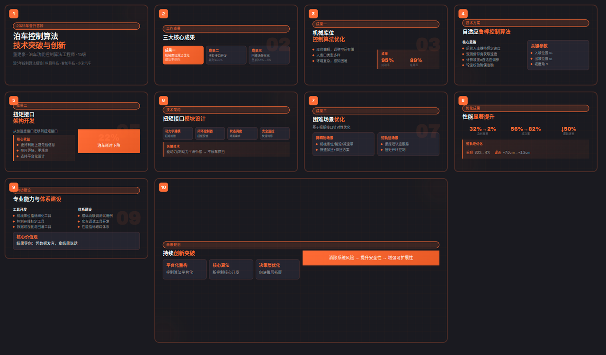
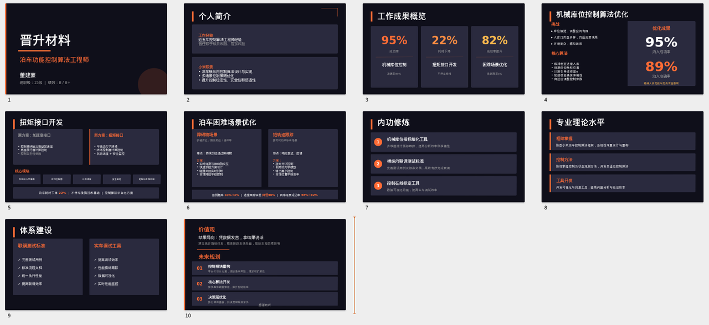
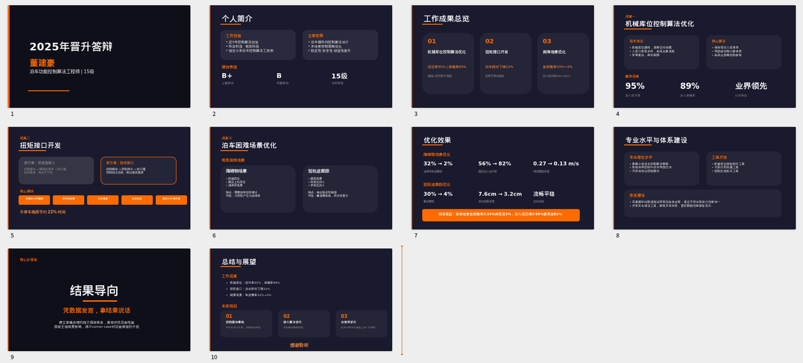
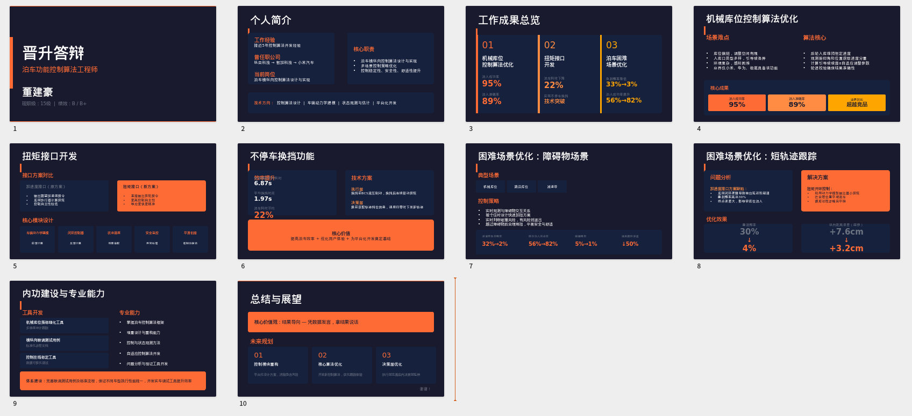
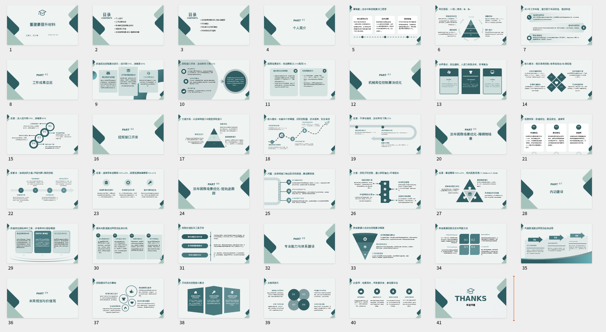
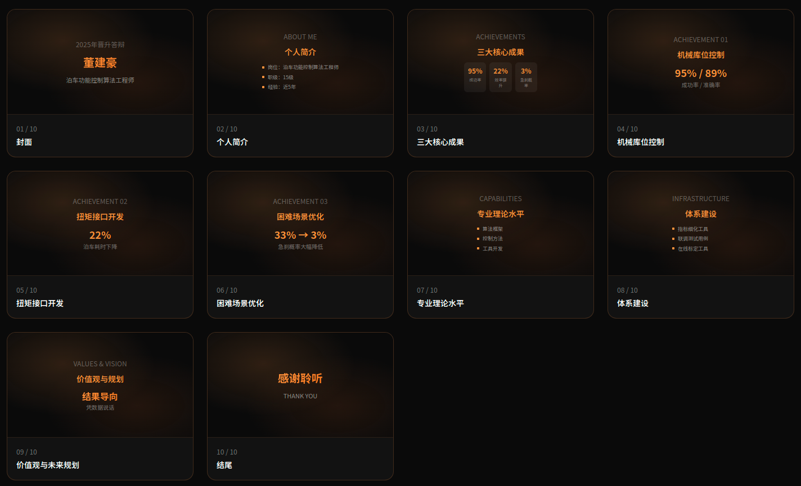
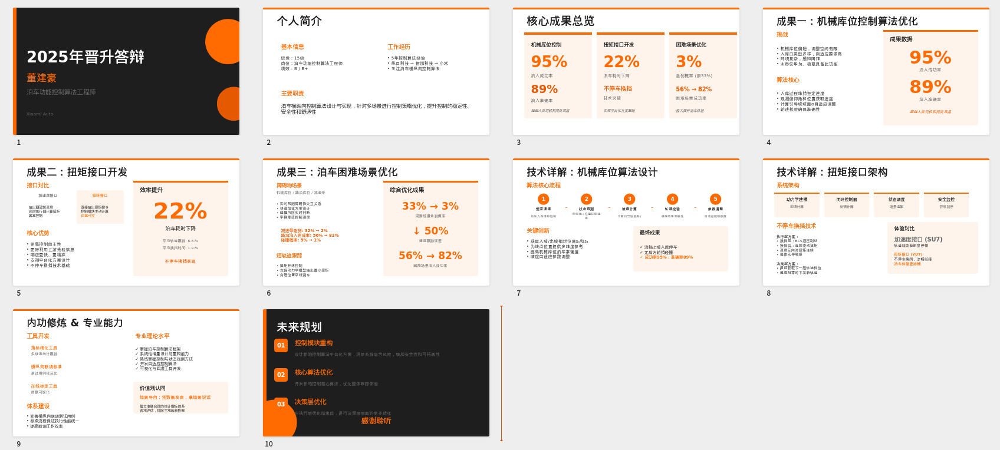
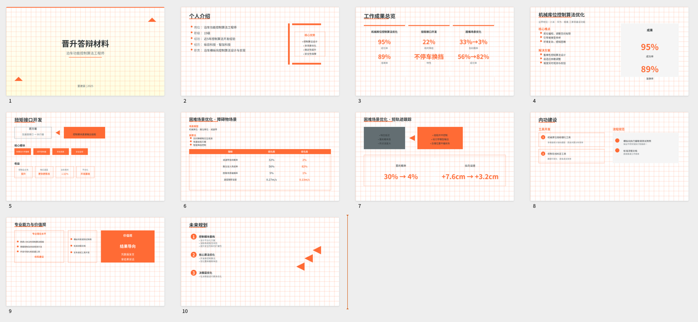

presentation-design：设计规范，都可以带着

frontend-slides：html

pptx-presentation-builder：这个各方面比较好，也懂得突出数据重点
调用presentation-design和pptx-presentation-builder，根据~/PPTX/words.pdf里的内容，按照先总结，再分开叙述的逻辑，制作PPT，要求页数10页，橙色调，简约，科技风格，输出文件名pptx-presentation-builder

elite-powerpoint-designer

pptx：有点太满了

ai-ppt-generate：纯纯套模版

ppt-generator：内容太少

ai-presentation-maker：风格不统一

baoyu-slide-deck：丑

