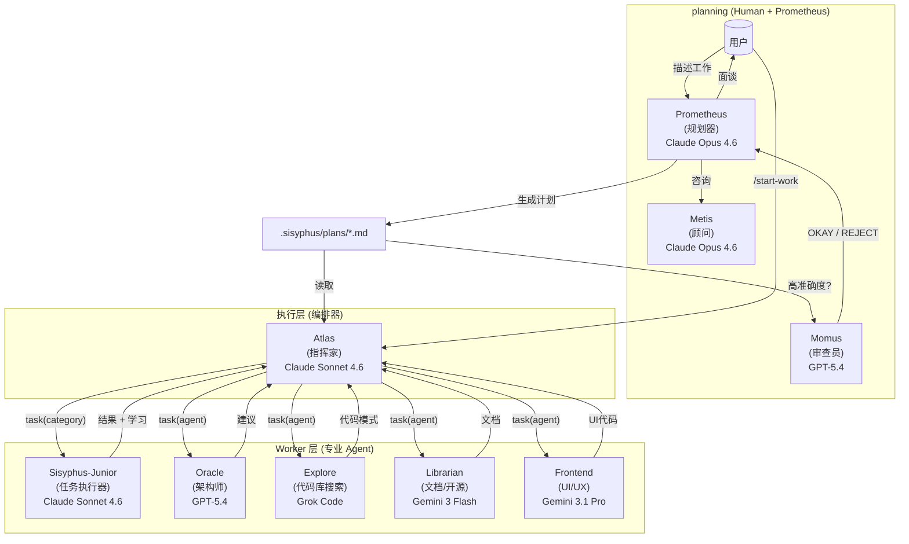
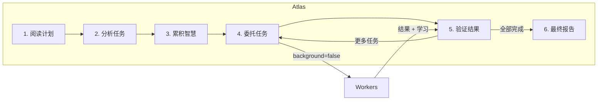

[TOC]
# 工作模式

## 简单任务
直接输入prompt对话

## 复杂任务端到端
**Hephaestus 模式**
Hephaestus 运行于 GPT-5.3 Codex，当需要深度架构推理、跨多文件的复杂调试或跨领域知识合成时，给他一个目标，不用详细步骤，他会自己探索代码库、研究模式、端到端执行无需手把手指导。
但是这个模式深度绑定GPT-CODEX，没有的话就别用了

## 复杂任务分解模式
### 可控版
**Prometheus + Atlas 模式**
先plan，再执行。进入plan模式有两种方式
1. 在任意输入框中输入@plan 目标
2. 按 **Tab** 键进入 Prometheus 模式，在输入框中输入目标（**推荐，更直观**）

Prometheus 像真正的工程师一样与你面谈，提出澄清问题，识别范围和歧义，在动笔之前制定详细计划，然后运行 `/start-work`，Atlas 接管任务，任务分配给专业Subagent，每个完成项独立验证，学习成果在任务间累积，进度跨会话追踪，将 Prometheus 用于多日项目、生产环境关键更改、重构，或需要留存决策记录的场景

### 懒人版
**Sisyphus + Ultrawork 模式：适合懒人**
直接输入 `ultrawork` 或 `ulw` ，Agent 会自行完成一切，探索代码库，研究模式，实现功能，用诊断工具验证，持续工作直到完成，这就是"放手去做"模式，全自动运作，你无需深入思考，因为 Agent 会为你深度思考。
所以可以对Sisyphus说明用户的意图，如果他判断该任务比较复杂，就会自动开始分析，并指派Prometheus来规划，让Atlas来执行（具体执行还是下面的subagents），在这个过程中Sisyphus就是战略官，Atlas就是项目经理

**推荐模型：**

- **Claude Opus 4.6** — 最佳整体体验，Sisyphus 基于优化的 Claude 提示词构建，
- **Claude Sonnet 4.6** — 能力和成本的良好平衡，
- **Kimi K2.5** — 优秀的类 Claude 替代方案，许多用户专门使用此组合，
- **GLM 5** — 稳健的选择，尤其通过 Z.ai 使用，

Sisyphus 在 Claude 系列模型、Kimi 和 GLM 上表现最佳，GPT-5.4 现在有专用提示路径，但较旧的 GPT 模型仍然不太适合，应改用 Hephaestus

# 复杂任务模式
## 架构设计
编排系统采用三层架构，通过专业化分工和委托机制解决上下文过载、认知漂移和验证缺口问题，



## 规划：Prometheus + Metis + Momus

### Prometheus：你的战略顾问

Prometheus 不仅仅是规划器，它是一个智能面谈者，帮助你思考自己真正需要什么，它是**只读**的 — 只能创建或修改 `.sisyphus/` 目录内的 markdown 文件，

**意图特定策略：**

Prometheus 根据你的工作内容调整面谈风格：

| 意图 | Prometheus 关注点 | 示例问题 |
| --- | ---------------- | ------- |
| **重构**        | 安全性 - 行为保留 | "哪些测试验证当前行为？" "回滚策略是什么？|
| **从零构建**     | 发现 - 模式优先  | "在代码库中发现模式 X，遵循还是偏离？     |
| **中等规模任务** | 护栏 - 精确边界   | "什么必须不包括？硬性约束是什么？        |
| **架构**        | 战略 - 长期影响   | "预期生命周期？规模需求？               |

### Metis：差距分析器

在 Prometheus 撰写计划之前，Metis 捕捉 Prometheus 遗漏的内容：

- 用户请求中的隐藏意图
- 可能导致实现偏离的歧义
- AI-slop 模式（过度工程、范围蔓延）
- 缺失的验收标准
- 未处理的边缘情况

**为什么 Metis 存在：**

计划作者（Prometheus）有"ADHD 工作记忆" — 它建立的连接从未出现在页面上，Metis 强制将隐性知识外化，

### Momus：无情审查员

对于高准确度模式，Momus 根据四个核心标准验证计划：

1. **清晰度**：每个任务是否指定了在哪里找到实现细节？
2. **验证**：验收标准是否具体且可衡量？
3. **上下文**：是否有足够的上下文可以继续而不需要超过 10% 的猜测？
4. **大局观**：目的、背景和工作流程是否清晰？

**Momus 循环：**

Momus 只有在以下情况才会说 "OKAY"：

- 100% 的文件引用已验证
- ≥80% 的任务有明确的引用来源
- ≥90% 的任务有具体的验收标准
- 零任务需要关于业务逻辑的假设
- 零关键红色标志

如果被拒绝，Prometheus 修复问题并重新提交，无最大重试次数限制，

## 指挥：Atlas

### 指挥家心态

Atlas 就像交响乐团的指挥：他不演奏乐器，他确保完美的和谐，



**Atlas 能做的：**

- 阅读文件以理解上下文
- 运行命令以验证结果
- 使用 lsp_diagnostics 检查错误
- 用 grep/glob/ast-grep 搜索模式

**Atlas 必须委托的：**

- 编写或编辑代码文件
- 修复 bug
- 创建测试
- Git 提交

### 智慧累积

编排的力量在于累积学习，每个任务后：

1. 从子 Agent 的响应中提取学习成果
2. 分类为：约定、成功、失败、陷阱、命令
3. 传递给所有后续子 Agent

这防止重复错误并确保模式一致，

**笔记本系统：**

```
.sisyphus/notepads/{plan-name}/
├── learnings.md      # 模式、约定、成功方法
├── decisions.md      # 架构选择和理由
├── issues.md         # 遇到的问题、阻塞、陷阱
├── verification.md   # 测试结果、验证结果
└── problems.md       # 未解决的问题、技术债务
```

---

## 执行：Sisyphus-Junior 和专业人员

### Sisyphus-Junior：任务执行器

Junior 是实际编写代码的人，关键特征：

- **专注**：不能委托（被阻止使用 task 工具）
- **自律**：强迫性 todo 跟踪
- **验证**：必须在完成前通过 lsp_diagnostics
- **受限**：不能修改计划文件（只读）

Junior 不需要最聪明 — 它需要可靠，凭借：

1. 来自 Atlas 的详细提示（50-200 行）
2. 传递的累积智慧
3. 清晰的 MUST DO / MUST NOT DO 约束
4. 验证要求

即使是中档模型也能精确执行，智能在**系统**中，而非单个 Agent，

### 系统提醒机制

hook 系统确保 Junior 永远不会半途而废：

```
[系统提醒 - TODO 继续]

你有未完成的 todos！完成所有后再回复：
- [ ] 实现用户服务 ← 进行中
- [ ] 添加验证
- [ ] 编写测试

在所有 todos 标记为完成之前不要回复，
```

这种"推巨石"机制是系统以 Sisyphus 命名的原因，

## 进度记录系统
运行 `/start-work` 时 Atlas 会自动激活，你无需手动切换到 Atlas
```
用户：/start-work
    ↓
[start-work hook 激活]
    ↓
检查：.sisyphus/boulder.json 是否存在？
    ↓
    ├─ 是（现有工作）→ 恢复模式
    │   - 读取现有 boulder 状态
    │   - 计算进度（已勾选 vs 未勾选框）
    │   - 注入剩余任务的继续提示
    │   - Atlas 从你离开的地方继续
    │
    └─ 否（新开始）→ 初始化模式
        - 找到 .sisyphus/plans/ 中最新的计划
        - 创建新的 boulder.json 跟踪此计划
        - 将会话 Agent 切换到 Atlas
        - 从任务 1 开始执行
```
**会话连续性说明：**

`boulder.json` 文件跟踪：

- **active_plan**：当前计划文件路径
- **session_ids**：所有处理过此计划的会话
- **started_at**：工作开始时间
- **plan_name**：人类可读的计划标识符